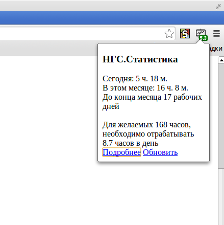

НГС.Статистика
=======

Расширение для chrome, показывающая текущую статистику отработанных часов

[Скачать](myngs.crx?raw=true)

Для установки откройте Инструменты -> Расширения и перетащите туда myngs.crx

Потом необходимо зайти в настройки расширения и указать свой логин на НГС

Текущая версия не умеет подхватывать настройки, поэтому после их смены расширение нужно выключить и включить.

Баги, пожелания отправлять на s.ivanov@office.ngs.ru
